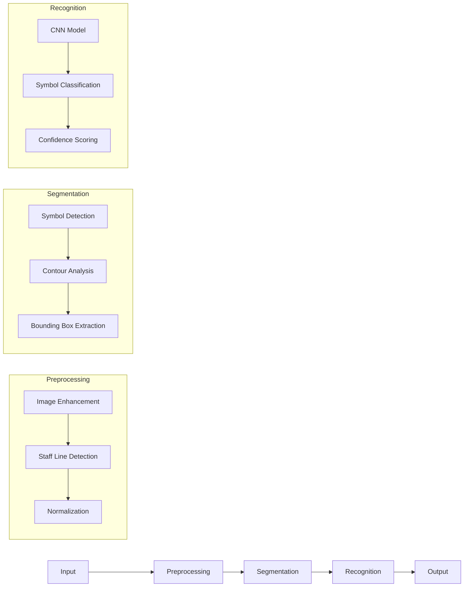

# SuperSMM Project Overview

## Project Information
- **Name**: Sheet Music Master (SuperSMM)
- **Core Purpose**: Optical Music Recognition (OMR) system
- **Repository**: League of Orphans (LOO) initiative

## Technical Stack
- **Language**: Python 3.11+
- **Core Libraries**:
  - TensorFlow: Neural network models
  - OpenCV: Image processing
  - NumPy: Numerical operations
  - FastAPI: API framework (planned)

## Architecture
### Modular Pipeline Architecture

## Key Components

### 1. OMR Pipeline
- **Location**: `src/core/omr_pipeline.py`
- **Purpose**: Orchestrates the entire OMR process
- **Features**:
  - Configuration management via dataclasses
  - Comprehensive logging system
  - Error recovery mechanisms
  - Performance tracking

### 2. Configuration System
- **Location**: `src/config/`
- **Features**:
  - Type-safe dataclasses
  - YAML configuration support
  - Environment variable overrides

### 3. Processing Modules
- **Advanced Preprocessor**: Staff line detection, image cleanup
- **Symbol Segmenter**: Contour detection, symbol extraction
- **Symbol Recognizer**: CNN-based classification

## Development Status
 Core pipeline implementation complete
 Configuration system refactored to use dataclasses
 Unit tests implemented for main components
 Active development on symbol recognition accuracy

Welcome to the SuperSMM (Super Sheet Music Master) documentation!

This site provides comprehensive information for users, developers, and contributors to the SuperSMM platform.

Browse through the guides to learn more about:
- How to use SuperSMM.
- How to develop and contribute to the platform.
- Key architectural decisions and standards.

If you are new here, start with the User Guides to get an overview of the platform's capabilities.

## Project Setup

Information on setting up the project environment can be found here.
