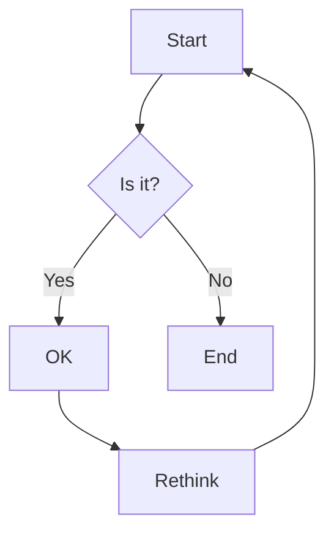

# HMM Model Variations and API Documentation

This document contains notes on different Hidden Markov Model (HMM) types from the `hmmlearn` library and a link to the API documentation.

## HMM Model Types Discussed

The following HMM model types from `hmmlearn` were considered or used in the project:

1.  **`hmmlearn.hmm.MultinomialHMM`**:
    *   This model was initially considered/used.
    *   Suitable for observations that are counts of multiple discrete features (e.g., word counts in a document).
    *   In `hmmlearn`, this model expects each observation to be an array of counts for each feature.

2.  **`hmmlearn.hmm.CategoricalHMM`**:
    *   This is the model currently adopted for tasks like staff removal where observations are discretized into categories.
    *   Suitable for sequences of discrete, categorical observations where each observation at a time step is one of `K` categories (symbols).
    *   The `n_features` parameter in `CategoricalHMM` corresponds to the number of distinct observable symbols or categories for the emissions. For example, if observations are discretized into 10 bins, `n_features` would be 10.
    *   Emission probabilities (`emissionprob_`) for this model are a matrix of shape `(n_components, n_features)`, where `n_components` is the number of hidden states. Each row (representing a state) must sum to 1.

3.  **`hmmlearn.hmm.GaussianHMM`**:
    *   This model was mentioned as an alternative for different types of data.
    *   Suitable for sequences of continuous observations that are assumed to be generated from Gaussian distributions (or a mixture of Gaussians per state).
    *   Requires parameters like means and covariances for the Gaussian emissions.

## `hmmlearn` API Documentation

For detailed information on these models and other functionalities of the `hmmlearn` library, refer to the official API documentation:

[hmmlearn API Documentation](https://hmmlearn.readthedocs.io/en/latest/api.html)

This link provides comprehensive details on:
- Model parameters (e.g., `n_components`, `startprob_`, `transmat_`, `emissionprob_`, `means_`, `covars_`, `covariance_type`)
- Methods (e.g., `fit()`, `predict()`, `decode()`, `sample()`)
- Underlying algorithms and assumptions for each HMM type.

## Example Mermaid Diagram

Here is a simple flowchart:

