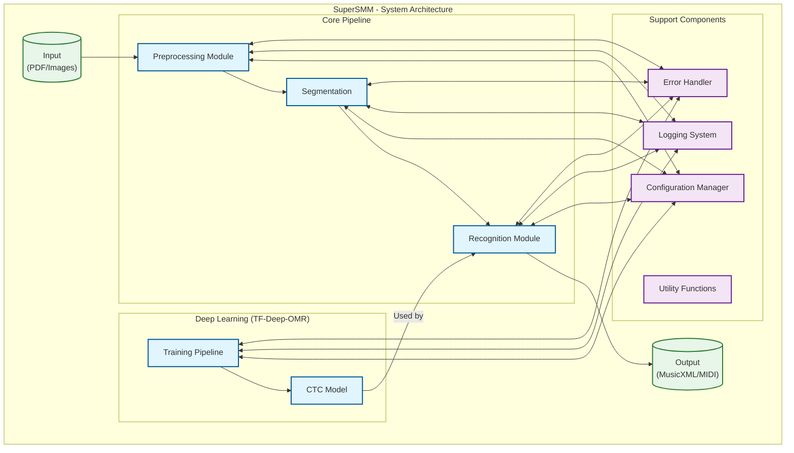

# SuperSMM System Architecture

## Overview

This document outlines the high-level architecture of the SuperSMM Optical Music Recognition (OMR) system. The system is designed to process sheet music images and convert them into machine-readable music notation.

## Architecture Diagram

## Component Descriptions

### 1. Input/Output
- **Input**: Accepts PDFs or images of sheet music
- **Output**: Produces MusicXML/MIDI files

### 2. Core Pipeline

#### Preprocessing Module
- Image enhancement and normalization
- Staff line detection and removal
- Page segmentation

#### Segmentation Module
- Symbol detection and extraction
- Staff and measure separation
- Note grouping and relationships

#### Recognition Module
- Symbol classification
- HMM-based decoding
- Music notation generation

### 3. Deep Learning (TF-Deep-OMR)
- **CTC Model**: Connectionist Temporal Classification model for sequence prediction
- **Training Pipeline**: Handles model training and evaluation

### 4. Support Components
- **Configuration Manager**: Centralized configuration management
- **Logging System**: Structured logging and monitoring
- **Utility Functions**: Common helper functions
- **Error Handler**: Centralized error management

## Data Flow

### Forward Processing Flow
1. **Input** → **Preprocessing**
   - Image loading and validation
   - Enhancement and normalization
   - Staff line detection/removal

2. **Preprocessing** → **Segmentation**
   - Staff and measure detection
   - Symbol extraction and grouping
   - Musical context analysis

3. **Segmentation** → **Recognition**
   - Symbol classification
   - Temporal sequence analysis
   - Music notation generation

4. **Recognition** → **Output**
   - MusicXML/MIDI generation
   - Validation and formatting

### Training Flow
1. **Training Data** → **Preprocessing**
   - Data augmentation
   - Feature extraction

2. **Preprocessing** → **CTC Training**
   - Model training
   - Validation and evaluation
   - Checkpointing

3. **CTC Model** → **Recognition**
   - Model deployment
   - Inference support

## Cross-Cutting Concerns

### Configuration Management
- Centralized configuration for all components
- Environment-specific settings
- Runtime adjustments

### Logging and Monitoring
- Structured logging
- Performance metrics
- System health monitoring

### Error Handling
- Centralized error management
- Graceful degradation
- Recovery mechanisms

## Integration Points

1. **TF-Deep-OMR Integration**
   - Model serving
   - Batch processing
   - Training pipeline

2. **External Services**
   - File storage
   - API endpoints
   - User interface

## Performance Considerations

1. **Optimization Areas**
   - Image processing pipeline
   - Model inference speed
   - Memory management

2. **Scalability**
   - Batch processing support
   - Distributed processing
   - Resource utilization

## Future Extensions

1. **Model Improvements**
   - Advanced architectures
   - Transfer learning
   - Ensemble methods

2. **Feature Additions**
   - Handwritten music recognition
   - Real-time processing
   - Collaborative editing

---

*Last updated: May 17, 2025*
