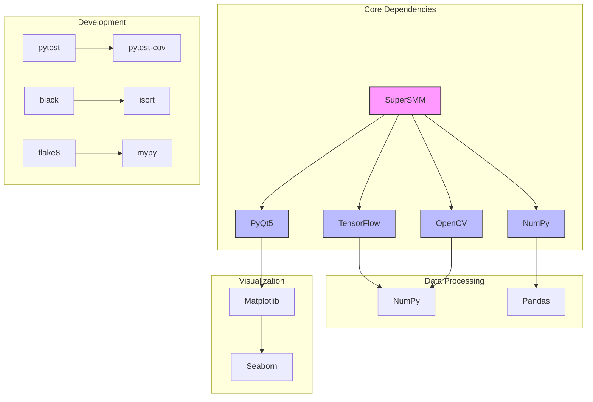

# SuperSMM Dependency Analysis

## Overview
This document provides a comprehensive analysis of the project's dependencies, including their purposes, versions, and relationships.

## Core Dependencies

### Main Project Dependencies (requirements.txt)
```
numpy>=1.21.0                 # Numerical computing
opencv-python>=4.5.0          # Image processing
tensorflow>=2.8.0             # Deep learning framework
PyMuPDF>=1.18.0               # PDF processing
matplotlib>=3.4.0             # Plotting and visualization
seaborn>=0.11.0               # Statistical data visualization
PyQt5>=5.15.0                 # GUI framework
Pillow>=8.3.0                 # Image processing
psutil>=5.8.0                 # System monitoring
PyYAML>=5.4.0                 # Configuration file parsing
```

### TF-Deep-OMR Dependencies (requirements-tf-deep-omr.txt)
```
# Core
tensorflow>=2.0.0
numpy>=1.16.0
matplotlib>=3.0.0
pyyaml>=5.1
opencv-python-headless>=4.2.0

# Development
pytest>=6.0.0
pytest-cov>=2.8.0
black>=21.5b2
isort>=5.0.0
flake8>=3.8.0
mypy>=0.800

# Logging and monitoring
pandas>=1.0.0
psutil>=5.7.0
```

## Dependency Analysis

### 1. Core Functionality

#### Image Processing
- **OpenCV (opencv-python)**: Primary image processing
  - Used for: Image loading, preprocessing, feature extraction
  - Version: 4.5.0+ (main), 4.2.0+ (TF-Deep-OMR)
  - Potential issue: Version mismatch between main and TF-Deep-OMR

- **Pillow**: Alternative image processing
  - Used for: Image manipulation and format conversion
  - Version: 8.3.0+

#### Deep Learning
- **TensorFlow**: Core deep learning framework
  - Used for: Model training and inference
  - Version: 2.8.0+ (main), 2.0.0+ (TF-Deep-OMR)
  - Potential issue: Version range is quite wide

#### Data Processing
- **NumPy**: Numerical computing
  - Used for: Array operations, numerical computations
  - Version: 1.21.0+ (main), 1.16.0+ (TF-Deep-OMR)

- **Pandas**: Data manipulation
  - Used for: Data analysis and logging
  - Version: 1.0.0+

### 2. Development Dependencies

#### Testing
- **pytest**: Test framework
- **pytest-cov**: Test coverage
- **Version**: 6.0.0+

#### Code Quality
- **black**: Code formatting
- **isort**: Import sorting
- **flake8**: Linting
- **mypy**: Type checking

### 3. GUI and Visualization
- **PyQt5**: Desktop application framework
  - Used for: Main application interface
  - Version: 5.15.0+

- **Matplotlib**: Plotting library
  - Used for: Visualization of results and metrics
  - Version: 3.4.0+ (main), 3.0.0+ (TF-Deep-OMR)

- **Seaborn**: Statistical visualization
  - Used for: Advanced plotting
  - Version: 0.11.0+

## Potential Issues

1. **Version Conflicts**
   - Different minimum versions between main project and TF-Deep-OMR
   - TensorFlow version range is quite wide (2.0.0 to 2.8.0+)

2. **Redundant Dependencies**
   - Both OpenCV and Pillow for image processing
   - Multiple visualization libraries (Matplotlib, Seaborn)

3. **Development Dependencies**
   - Some development tools might be better as dev dependencies
   - No separation between production and development requirements

## Recommendations

1. **Version Alignment**
   ```
   # Recommended unified versions
   tensorflow>=2.8.0
   numpy>=1.21.0
   opencv-python>=4.5.0
   ```

2. **Dependency Organization**
   - Create separate `requirements-dev.txt` for development tools
   - Consider using `setup.cfg` or `pyproject.toml` for better dependency management

3. **Dependency Updates**
   - Update minimum versions to ensure compatibility
   - Consider using exact versions for production

## Dependency Graph



## Security Considerations

1. **Outdated Packages**
   - Regularly update dependencies to address security vulnerabilities
   - Use tools like `safety` or `dependabot` for security scanning

2. **Minimal Installation**
   - Consider using `--no-deps` for production installations
   - Use virtual environments to isolate dependencies

## Performance Impact

1. **Heavy Dependencies**
   - TensorFlow and PyQt5 are large packages
   - Consider lazy loading for optional features

2. **Memory Usage**
   - Multiple visualization libraries can increase memory footprint
   - Consider alternative lightweight visualization for production

---

*Last updated: May 17, 2025*
